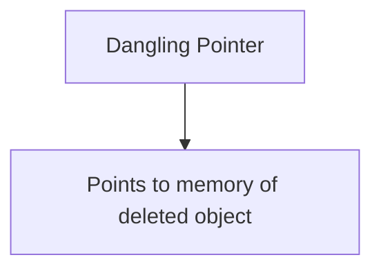
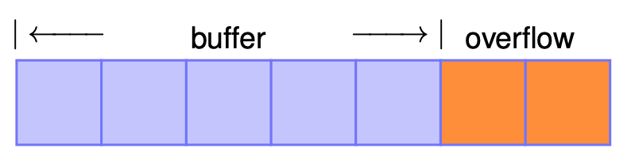

# Vulnerability Assessment and Secure Coding 

Common Types of Software Vulnerabilities

Here is the properly formatted version of your content:

---

## Common Types of Software Vulnerabilities

### Memory Safety Errors

#### 1. Memory Leaks

**Description:** Failure to release allocated memory can lead to resource exhaustion.
**Example:** Forgetting to `free()` memory in C after using `malloc()`.

#### 2. Null Pointer Dereferences

**Description:** Accessing memory through a null pointer causes crashes or undefined behavior.
**Example:** Using `*ptr` when `ptr == NULL`.

#### 3. Dangling Pointers and Use-After-Frees

**Description:** Accessing memory after it has been freed can lead to corruption or code execution.
**Example:**

```c
free(ptr);  
*ptr = 5; // ptr is now dangling
```

#### 4. Buffer Overflows

**Description:** Writing outside the bounds of an array causes data corruption or exploits.
**Example:**

```c
char buf[10];  
strcpy(buf, "This is more than ten characters");
```

---

## 🧠 Memory Leaks (A Vulnerable Example)

A **memory leak** happens when a program **allocates memory dynamically** (using `new`, `malloc`, etc.) but **never releases** it using `delete` or `free`. Over time, this unused memory builds up, wasting system resources and potentially causing your program to crash or slow down.

---

### 🚨 Vulnerable Code Example

```cpp
typedef struct Node {
    int data;
    struct Node *next;
} Node;

typedef struct List {
    struct Node *head;
} List;

List* create_list(int num) {
    List *list = new List();         // Allocate memory for the list
    Node *current = list->head;      // current is uninitialized here!
    for (int i = 0; i < num; i++) {
        current = new Node();        // Allocate a new node
        current = current->next;     // current becomes NULL — list is broken
    }
    return list;
}

void free_list(List *l) {
    Node *current = l->head;
    while (current != nullptr) {
        Node *next = current->next;
        delete current;
        current = next;
    }
}
    
int main() {
    List *l = create_list(10);  // Create a list of 10 nodes
    // Do something with the list
    free_list(l);               // Try to free the list
}
```

---

### ❌ What's Wrong?

1. **Memory Leak in `create_list`:**

   * The list never actually links the new nodes correctly.
   * The `head` remains `nullptr`, and the nodes created are lost.
2. **Memory Leak in `main`:**

   * `free_list` deletes the nodes (if properly linked), but **does not delete the `List` object itself** (`new List()` was never freed).

---

### ✅ How to Fix It

#### 🛠 Fix #1: Correct the list construction

We must link each newly created node to form the list properly.

```cpp
List* create_list(int num) {
    List *list = new List();
    list->head = nullptr;
    Node *current = nullptr;

    for (int i = 0; i < num; i++) {
        Node *new_node = new Node();
        new_node->data = i;
        new_node->next = nullptr;

        if (list->head == nullptr) {
            list->head = new_node;
            current = new_node;
        } else {
            current->next = new_node;
            current = new_node;
        }
    }
    return list;
}
```

#### 🛠 Fix #2: Properly free the list and the `List` object

```cpp
void free_list(List *l) {
    Node *current = l->head;
    while (current != nullptr) {
        Node *next = current->next;
        delete current;
        current = next;
    }
    delete l; // Also free the List object itself
}
```

#### 🛠 Fix #3: Avoid dangling pointers in `main`

```cpp
int main() {
    List *l = create_list(10); // Create a list of 10 nodes
    // Do something with the list
    free_list(l);              // Free memory
    l = nullptr;               // Prevent dangling pointer usage
}
```

---

## ⚠️ Null Pointer Dereferences (A Vulnerable Example)

A **null pointer dereference** occurs when a program tries to access memory through a pointer that is `NULL`. This usually leads to a **segmentation fault**, **crash**, or **undefined behavior**.

---

### 🚨 Vulnerable Code Example

```c
struct Student {
    int id;
    char *name;
} Student;

Student students[10] = { ... }; // Assume this array is properly initialized

Student* findStudentRecord(int sID) {
    for (int i = 0; i < 10; i++) {
        if (students[i].id == sID) {
            return &students[i];
        }
    }
    return nullptr; // Student not found
}

int main(int argc, char **argv) {
    int stuID;
    scanf("%d%c", &stuID);        // Read student ID and a character
    Student *student = findStudentRecord(stuID);
    printf("%s\n", student->name); // 💥 POTENTIAL CRASH if student == nullptr
}
```

---

### ❌ What's Wrong?

* If the student ID entered by the user **does not match any record**, `findStudentRecord()` returns `nullptr`.
* The program **does not check** whether `student` is null before accessing `student->name`.
* This causes a **null pointer dereference**, which crashes the program.

---

### 📌 What Does `scanf("%d%c", &stuID);` Do?

* `%d` reads an **integer** and stores it in `stuID`.
* `%c` reads the **next character**, typically the newline (`\n`) from pressing Enter.
* This can cause unexpected behavior if you only meant to read a number.
* **Fix (optional):** Use `scanf("%d", &stuID);` to avoid the extra character read.

---

### ✅ Fix: Add a Runtime Check (Assertion)

We can **stop the program early** if `student` is `nullptr` using an `assert`.

```c
#include <assert.h>

int main(int argc, char **argv) {
    int stuID;
    scanf("%d", &stuID); // Safer version, avoids confusion with %c
    Student *student = findStudentRecord(stuID);

    assert(student != nullptr); // 🛑 Prevent null pointer dereference

    printf("%s\n", student->name);
}
```

---

### 💡 Why Use `assert`?

* `assert(condition)` checks if a condition is true.
* If false, it prints an error and **terminates** the program.
* It's a **safe way to catch programming errors** before they cause crashes or security issues.

---

## 🧨 Dangling References and Use-After-Frees

### 🧵 What Are Dangling References?

A **dangling reference** (or dangling pointer) occurs when a pointer still **points to memory that has already been freed**. Using such a pointer after the object is freed leads to **use-after-free** vulnerabilities, which can cause:

* **Crashes**
* **Data corruption**
* **Security vulnerabilities** (e.g., attackers can exploit freed memory)

> 📚 **Reference**: CWE-416 — [Use After Free](https://cwe.mitre.org/data/definitions/416.html)

---

### 📊 Visualization



---

### 🚨 Vulnerable Code Example

```c
char *ptr = (char *) malloc(SIZE);
...
if (err) {
    abrt = 1;
    free(ptr);      // Memory is deallocated
}
...
if (abrt) {
    logError("Operation aborted before commit", ptr);  // 💥 Dangling pointer usage
}
```

---

### ❌ What's the Bug?

Yes, **there is a bug** in the code. After `free(ptr)`, the `ptr` still holds the same (now invalid) memory address. Passing it to `logError()` is **dangerous** because it's a **use-after-free**.

---

### ✅ How to Fix the Bug

After freeing a pointer, always **nullify it** to prevent accidental reuse. Also, add a runtime check (e.g., `assert`) before using the pointer.

```c
char *ptr = (char *) malloc(SIZE);
...
if (err) {
    abrt = 1;
    free(ptr);
    ptr = nullptr; // Nullify to avoid dangling reference
}
...
if (abrt) {
    assert(ptr != nullptr); // Sanity check to catch logic errors
    logError("Operation aborted before commit", ptr);
}
```

---

Here is a beginner-friendly, clearly explained version of the **Buffer Overflow** section, including analysis, visualization reference, and fix:

---

## 💥 Buffer Overflows

A **buffer overflow** occurs when a program **writes more data to a buffer than it can hold**, leading to **overwriting adjacent memory**. This can cause:

* Program crashes
* Data corruption
* Serious **security vulnerabilities** (e.g., code injection)

> 📚 **Reference**: CWE-119 — [Improper Restriction of Operations within the Bounds of a Memory Buffer](https://cwe.mitre.org/data/definitions/119.html)

 


### ⚠️ Vulnerable Code Example

```c
void bufferRead() {
    int n = 0;
    int ret = scanf("%d", &n);     // Read the input size
    if (ret != 1 || n > 100) {
        return;                    // Guard clause: input too large or invalid
    }

    char *p = (char *) malloc(n);  // Allocate buffer of size n
    int y = n;
    if (p == NULL) return;         // Check for allocation failure

    p[y] = 'a';                    // ❌ Writes to memory just outside the buffer
    free(p);
    p = nullptr;
}
```

---

### ❌ What's the Bug?

Yes, **there is a bug** in the line:

```c
p[y] = 'a';
```

The buffer `p` has valid indices from `0` to `n - 1`. But `p[y] = 'a';` is accessing **index `n`**, which is **one past the end of the allocated buffer** — this is a **classic off-by-one buffer overflow**.

---

### ✅ How to Fix It

We should ensure that we **never write past the last valid index** (`n - 1`):

```c
void bufferRead() {
    int n = 0;
    int ret = scanf("%d", &n);
    if (ret != 1 || n > 100) {
        return;
    }

    char *p = (char *) malloc(n);
    if (p == NULL) return;

    // ✅ Safely write to the last valid index
    p[n - 1] = 'a';

    free(p);
    p = nullptr;
}
```

---

### 🧠 Key Lessons

| Mistake                                     | Fix                                         |
| ------------------------------------------- | ------------------------------------------- |
| Accessing index `n` on a buffer of size `n` | Use index `n - 1`                           |
| Writing without bounds check                | Always check limits before accessing arrays |
| Not validating input size                   | Use upper bounds like `n > 100` for safety  |

---


## 🔢 Integer Overflows

An **integer overflow** happens when a calculation exceeds the range representable by the integer type, either:

* **Too high**: exceeding the maximum value
* **Too low**: going below the minimum value

---

### 📊 Representable Ranges for Unsigned Integers

| Bits | Maximum Value                                       | Formula                       |
| ---- | --------------------------------------------------- | ----------------------------- |
| 4    | 15                                                  | 2⁴ − 1                        |
| 8    | 255                                                 | 2⁸ − 1                        |
| 16   | 65,535                                              | 2¹⁶ − 1                       |
| 32   | 4,294,967,295                                       | 2³² − 1 *(common in 2005)*    |
| 64   | 18,446,744,073,709,551,615                          | 2⁶⁴ − 1 *(common since 2017)* |
| 128  | 340,282,366,920,938,463,463,374,607,431,768,211,455 | 2¹²⁸ − 1                      |

---

### 🧠 Key Rules in C/C++

* **Signed integer overflow**: **undefined behavior**
* **Unsigned integer overflow**: **wraparound behavior**

> Wraparound means the result becomes `(value % 2^n)` where `n` is the bit width.

---

### 💡 Wraparound Example

For a 32-bit `unsigned int`:

```c
UINT_MAX = 2^32 - 1 = 4,294,967,295
```

Now:

| Expression     | Result |
| -------------- | ------ |
| `UINT_MAX + 1` | `0`    |
| `UINT_MAX + 2` | `1`    |
| `UINT_MAX + 3` | `2`    |

🔄 Because:

```c
(UINT_MAX + k) % 2^32 == k - 2^32
```

---

### 📚 Standard Limits

In `<limits.h>`:

| Macro      | Description                | Value (for 32-bit) |
| ---------- | -------------------------- | ------------------ |
| `INT_MIN`  | Minimum signed int value   | -2,147,483,648     |
| `INT_MAX`  | Maximum signed int value   | +2,147,483,647     |
| `UINT_MAX` | Maximum unsigned int value | 4,294,967,295      |

---

### ⚠️ Undefined Behavior with Signed Integers

```c
signed int x;
if (x > x + 1) {
    // Handle potential overflow
}
```

This condition **may be optimized away** by the compiler, because **`x + 1` > `x` is always expected to be true**, and the compiler **assumes overflow never happens**. But if `x == INT_MAX`, the result is undefined.

Another example:

```c
if (INT_MAX + 1 < 0) {
    // Will likely be optimized away
}
```

Because `INT_MAX + 1` is undefined, the compiler may assume this expression is unreachable.

---

### 🔁 Infinite Loop Due to Optimization

```c
signed int i = 1;
while (i > 0) {
    i *= 2;
}
```

This loop *appears* to terminate when `i` overflows into a negative number.

🛑 But: Since **signed overflow is undefined**, the compiler (e.g., GCC with `-O3`) may optimize the loop as **infinite**, because it assumes `i > 0` is *always* true.

✅ **Use `unsigned int`** if wraparound behavior is intentional.

---

### ✅ Takeaway

| Don't Do                           | Do Instead                                   |
| ---------------------------------- | -------------------------------------------- |
| Rely on signed integer overflow    | Use unsigned or perform bounds checks        |
| Use signed ints in unchecked loops | Use `size_t` or `unsigned` where appropriate |
| Ignore overflow implications       | Use tools like UBSan or static analyzers     |


---

### 🔍 Vulnerable Code

```c
int nresp = packet_get_int();
// nresp can be negative or MAX 
if (nresp > 0) {
    response = xmalloc(nresp * sizeof(char*));
    for (int i = 0; i < nresp; i++) {
        response[i] = packet_get_string(NULL);
    }
}
```

---

### ⚠️ What's the Problem?

The vulnerability arises from the multiplication `nresp * sizeof(char*)`. If `nresp` is a large value, such as `1,073,741,824` (i.e., 2³⁰), and `sizeof(char*)` is 4 bytes, the multiplication results in `4,294,967,296` bytes (i.e., 2³²). This value exceeds the maximum value representable by a 32-bit unsigned integer (`UINT_MAX`), causing an **integer overflow**.

Due to the overflow, the `xmalloc` function may allocate a significantly smaller buffer than intended. Subsequently, the loop that writes to `response[i]` may write beyond the allocated memory, leading to a **heap buffer overflow**. This type of vulnerability can be exploited by attackers to execute arbitrary code.

---

### 🛡️ Real-World Impact

This specific vulnerability was identified in **OpenSSH versions 2.3.1 through 3.3**, where an integer overflow in the handling of challenge-response authentication could be exploited to execute arbitrary code. The issue is documented as **CVE-2002-0640** .([NVD][1], [Vulert][2])

---

### ✅ How to Fix It

To prevent such vulnerabilities:

1. **Validate Input Ranges**: Ensure that input values are within expected bounds.

2. **Check for Integer Overflows**: Before performing arithmetic operations that could overflow, validate that the operation will not exceed the maximum allowable value.

3. **Use Safe Arithmetic Functions**: Utilize functions or libraries that provide safe arithmetic operations with built-in overflow checks.

4. **Implement Assertions**: Use assertions to enforce assumptions about variable values during development.

Here's the corrected version of the code with added checks:

```c
int nresp = packet_get_int();

if (nresp > 0 && nresp < (userDefinedSize / sizeof(char*))) {
    response = xmalloc(nresp * sizeof(char*));
    for (int i = 0; i < nresp; i++) {
        response[i] = packet_get_string(NULL);
    }
}
```

In this corrected version:

* `nresp` is checked to ensure it's positive and that the multiplication `nresp * sizeof(char*)` won't overflow.

* `userDefinedSize` represents the maximum allowable allocation size, defined based on application-specific constraints.

---

### 🧠 Key Takeaways

* **Integer Overflows**: Can lead to serious vulnerabilities like buffer overflows if not properly handled.

* **Input Validation**: Always validate inputs, especially when they influence memory allocation sizes.

* **Safe Coding Practices**: Implement checks and use safe functions to prevent arithmetic overflows.

* **Stay Informed**: Keep abreast of known vulnerabilities in the libraries and tools you use, and apply patches promptly.

If you need further assistance or examples on secure coding practices, feel free to ask!

[1]: https://nvd.nist.gov/vuln/detail/CVE-2002-0640?utm_source=chatgpt.com "CVE-2002-0640 Detail - NVD"
[2]: https://vulert.com/vuln-db/debian-10-openssh-129068?utm_source=chatgpt.com "Buffer Overflow Vulnerability in OpenSSH - Vulert"


---

## 🚫 Division by Zero (A Vulnerable Example)

### ❗ Vulnerable Code

```c
unsigned computerAverageResponseTime(unsigned totalTime, unsigned numRequests){
    return totalTime / numRequests;
}
```

### 🔍 Problem

This function assumes `numRequests` is non-zero. If `numRequests` is `0`, the division results in **undefined behavior** per the C standard (C11 §6.5.5), which can lead to:

* Program crashes
* Miscompilation
* Security vulnerabilities

### ✅ Fix: Add Runtime Check

```c
unsigned computerAverageResponseTime(unsigned totalTime, unsigned numRequests){
    assert(numRequests > 0); // Prevent division by zero
    return totalTime / numRequests;
}
```

### 🛡️ Best Practice

Always **validate divisor values** before performing division. For public-facing or critical systems, prefer:

```c
if (numRequests == 0) {
    // handle gracefully
    return 0; // or some error code
}
```

---

## 🧪 Tainted Information Flow (A Vulnerable Example)

### ❗ Vulnerable Code

```c
void main(int argc, char **argv){
    char *pMsg = packet_get_string();  // User-controlled input
    ParseMsg((LOGIN_MSG_BODY*) pMsg);  // Casted to internal structure
}

void ParseMsg(LOGIN_MSG_BODY *stLoginMsgBody){
    for(int ulIndex = 0; ulIndex < stLoginMsgBody->userLoginPwdLen; ulIndex){
        // do something
    }
}
```

### 🔍 Problem

* `packet_get_string()` returns data that might be **user-controlled and untrusted**.
* This string is cast directly to a `LOGIN_MSG_BODY*` without validation.
* The loop runs up to `userLoginPwdLen`, which can be **maliciously large**, leading to:

  * **Denial of Service (DoS)** via infinite or very long loops
  * **Memory access violations** (if buffer is too small)
  * **Information leakage**

### ✅ Fix: Sanitize and Bound Input

```c
void main(int argc, char **argv){
    char *pMsg = packet_get_string();
    ParseMsg((LOGIN_MSG_BODY*) pMsg);
}

void ParseMsg(LOGIN_MSG_BODY *stLoginMsgBody){
    assert(stLoginMsgBody->userLoginPwdLen < userDefinedSize); // Validate input
    for(int ulIndex = 0; ulIndex < stLoginMsgBody->userLoginPwdLen; ulIndex++){
        // do something safe
    }
}
```

### 🛡️ Best Practice

* **Never trust external input.** Always validate before usage.
* Casts from untyped memory (like `char*`) to structured data must include bounds checking.
* Add **sanity checks** on structure fields, especially when parsed from untrusted sources.

---

## ✅ Summary of Key Points

| Issue                 | Root Cause                                        | Fix                                                   |
| --------------------- | ------------------------------------------------- | ----------------------------------------------------- |
| **Division by Zero**  | No check on divisor                               | Add `assert(numRequests > 0);` or a conditional check |
| **Tainted Info Flow** | Untrusted input cast to struct without validation | Validate structure fields before use (`assert(...)`)  |


---

## Code Injection (Plain C example)

### Vulnerable code

```c
#include <stdio.h>
#include <stdlib.h>

int main() {
    char user_id[100];
    char command[150] = "cat user_info/";

    printf("Enter user_id: ");
    scanf("%99s", user_id);  // Read user input

    // Unsafe: directly appending user_id to command
    strcat(command, user_id);
    system(command);  // Dangerous if user_id contains malicious input

    return 0;
}
```

---

### Why is it unsafe?

* If user inputs `05 && ipconfig`, the system command executed will be:

  ```
  cat user_info/05 && ipconfig
  ```

* This runs **two** commands, which can leak information or damage the system.

---

### Secure version with input validation

```c
#include <stdio.h>
#include <stdlib.h>
#include <string.h>
#include <ctype.h>

int is_all_digits(const char *str) {
    while (*str) {
        if (!isdigit((unsigned char)*str))
            return 0;  // false if any char is not a digit
        str++;
    }
    return 1;  // true if all digits
}

int main() {
    char user_id[100];
    char command[150] = "cat user_info/";

    printf("Enter user_id: ");
    scanf("%99s", user_id);

    // Validate input: must be all digits
    if (!is_all_digits(user_id)) {
        printf("Invalid user_id! Only digits allowed.\n");
        return 1;  // exit with error
    }

    strcat(command, user_id);
    system(command);

    return 0;
}
```

---

### Explanation

* The helper function `is_all_digits()` checks each character of `user_id`.
* If any character is **not** a digit, it rejects the input.
* This prevents injection of shell operators like `&&`, `;`, `|`, etc.
* The program only runs the intended command with a numeric user ID.

---


Sure! Here's a clear explanation and example in plain C for the **Format String vulnerability** and the **SQL Injection vulnerability**, including which `printf` is safe and how to prevent SQL injection by validating input.

---

## Format String Vulnerability

### Vulnerable code snippet:

```c
#include <stdio.h>

int main(int argc, char **argv) {
    printf("%s\n", argv[1]);  // Safe usage
    printf(argv[1]);           // Vulnerable usage!
    return 0;
}
```

### Explanation:

* The first `printf` is **safe** because it explicitly uses a format string `"%s\n"`. The argument `argv[1]` is treated purely as a string to print.
* The second `printf` is **vulnerable** because it uses the user input directly as the format string. If the user input contains format specifiers like `%s`, `%x`, `%p`, the program will interpret these and try to read additional arguments from the stack, leading to crashes or data leaks.

### Example input:

```
Hello World %s%s%s%s%s
```

* The vulnerable `printf(argv[1]);` tries to read several string pointers from the stack that do not exist — causing crashes or unpredictable behavior.
* Worse, inputs like `"Hello World %p %p %p %p"` can leak memory addresses, helping attackers gather sensitive info for further exploitation.

---

## SQL Injection Vulnerability

### Vulnerable code snippet (pseudo C):

```c
char *txtUserId = getRequestString("UserId"); 
char txtSQL[256];

sprintf(txtSQL, "SELECT * FROM Users WHERE userId = %s", txtUserId);
```

### Why this is vulnerable:

* If the user enters `105 OR 1=1`, the query becomes:

```sql
SELECT * FROM Users WHERE userId = 105 OR 1=1
```

* This condition is always true (`1=1`), so the query returns all users, breaking security.

---

### How to fix: Input validation

```c
#include <stdio.h>
#include <string.h>
#include <ctype.h>
#include <assert.h>

int is_all_digits(const char *str) {
    while (*str) {
        if (!isdigit((unsigned char)*str))
            return 0;
        str++;
    }
    return 1;
}

int main() {
    char txtUserId[100];
    char txtSQL[256];

    printf("Enter UserId: ");
    scanf("%99s", txtUserId);

    assert(is_all_digits(txtUserId)); // Validate input is only digits

    sprintf(txtSQL, "SELECT * FROM Users WHERE userId = %s", txtUserId);

    printf("SQL query: %s\n", txtSQL);
    return 0;
}
```

* We check that the user ID consists **only of digits**.
* This prevents injection of additional SQL commands like `OR 1=1`.

---

### Summary:

| Issue         | Vulnerable Code                                                   | Fix                                                              |
| ------------- | ----------------------------------------------------------------- | ---------------------------------------------------------------- |
| Format String | `printf(argv[1]);`                                                | Use `printf("%s", argv[1]);` to specify format string explicitly |
| SQL Injection | `sprintf(txtSQL, "SELECT ... " + txtUserId)` with unchecked input | Validate input (e.g., digits only) or use prepared statements    |

---

### References:

* Format string paper: [https://cs155.stanford.edu/papers/formatstring-1.2.pdf](https://cs155.stanford.edu/papers/formatstring-1.2.pdf)
* Format string explanation: [https://robin-sandhu.medium.com/understanding-the-format-string-vulnerability-b2957630d886](https://robin-sandhu.medium.com/understanding-the-format-string-vulnerability-b2957630d886)

---

## Side-Channel Attack: Timing Leak in String Comparison

### Vulnerable Code (Timing Leak):

```c
#include <stdbool.h>

bool insecureCmp(const char *ca, const char *cb, int length) {
    for (int i = 0; i < length; i++) {
        if (ca[i] != cb[i]) {
            return false;  // Returns immediately on first mismatch
        }
    }
    return true; // All characters matched
}
```

---

### Why is this insecure?

* The function exits early on the first mismatched character.
* Attackers can measure how long the comparison takes and guess how many initial characters matched.
* Timing leaks allow incremental guessing of the secret password one character at a time.

### Example timing scenario:

| Input guess          | Time (ms) | Explanation           |
| -------------------- | --------- | --------------------- |
| "aaaaaaaaaaaaaaaaa"  | 1         | No matching chars     |
| "baaaaaaaaaaaaaaaa"  | 1         | No matching chars     |
| "Vaaaaaaaaaaaaaaaa"  | 2         | First char matches    |
| "V1aaaaaaaaaaaaaaaa" | 3         | First two chars match |

---

## Secure Version: Constant-Time Comparison

The fix is to always compare all characters, no matter what, and accumulate the result. This prevents early exit and makes timing independent of input similarity.

```c
#include <stdbool.h>
#include <assert.h>

bool secureCmp(const char *ca, const char *cb, int length) {
    bool result = true;
    int i;

    for (i = 0; i < length; i++) {
        result &= (ca[i] == cb[i]);
    }

    assert(i == length);  // Ensure loop runs full length every time

    return result;
}
```

---

### How does this fix the problem?

* The `for` loop always runs for all characters.
* `result` accumulates using bitwise AND (`&=`), so any mismatch will eventually make `result` false.
* Execution time is the same regardless of when mismatch happens, preventing timing side-channel leaks.

---

### Example Usage

```c
#include <stdio.h>

int main() {
    const char *secret = "V1cHt2S67DADJIm9s";
    const char *guess1 = "V1aaaaaaaaaaaaaaaa";
    const char *guess2 = "V1cHt2S67DADJIm9s";
    int len = 17;

    if (secureCmp(secret, guess1, len)) {
        printf("Guess1 matches secret\n");
    } else {
        printf("Guess1 does NOT match secret\n");
    }

    if (secureCmp(secret, guess2, len)) {
        printf("Guess2 matches secret\n");
    } else {
        printf("Guess2 does NOT match secret\n");
    }

    return 0;
}
```

---

### Summary

| Aspect                   | InsecureCmp                       | SecureCmp                     |
| ------------------------ | --------------------------------- | ----------------------------- |
| Early exit on mismatch   | Yes                               | No                            |
| Timing varies with input | Yes (vulnerable to timing attack) | No (constant time)            |
| Risk                     | Password leak via timing          | Prevents timing-based attacks |

---


