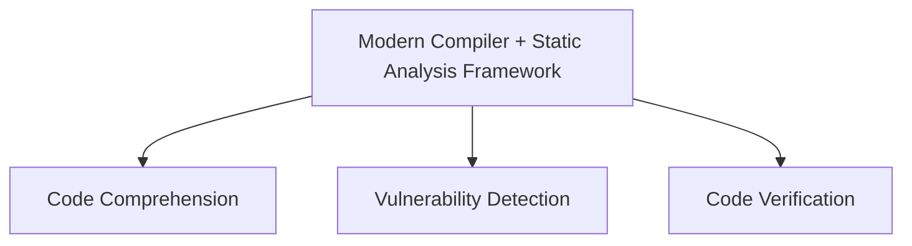
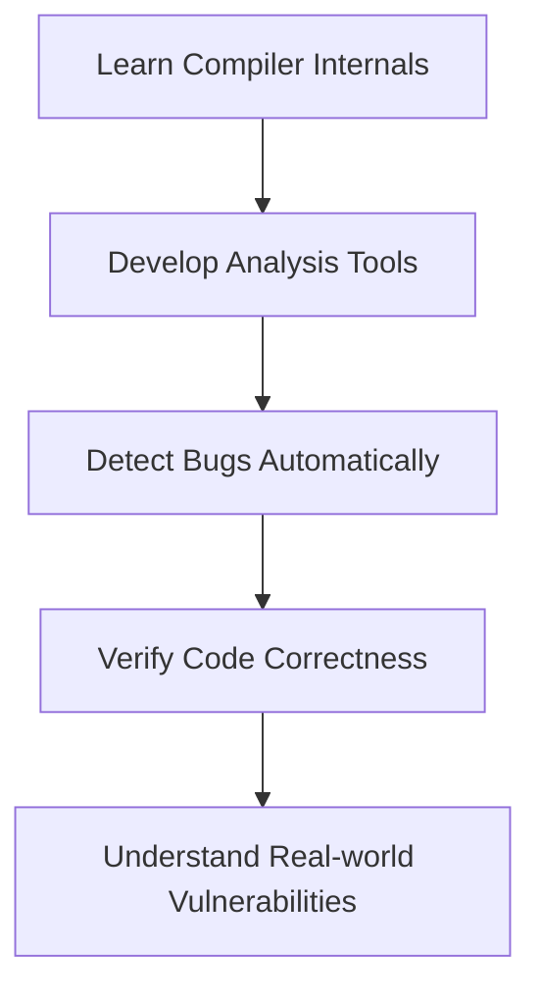

# Introduction to Software Security Analysis

## Opening Discussion

The lecture begins with two simple prompts to get you thinking:

1. **What words come to mind when you hear "Software Security Analysis"?**
   This helps understand your expectations and prior knowledge.

2. **What courses do you think are related to this one?**
   Some relevant courses might include:

   * *System and Software Security Assessment*
   * *Security Engineering and Cybersecurity*

---

## Course Aim

This course teaches you how to **automatically analyze and verify software code** using tools built on **modern compilers** and **open-source frameworks**. By the end of the course, you will be able to:

* Understand complex code more easily (code comprehension)
* Find and report software vulnerabilities (vulnerability detection)
* Prove that some parts of code are safe and correct (code verification)

These skills are especially valuable for working with large, real-world software systems like operating systems and security-critical applications.

---

## Teaching Structure and Evaluation

The course is structured into three main parts:

* **Lectures** – Explain core ideas and methods
* **Labs** – Hands-on sessions to apply what you learn
* **Assignments** – In-depth tasks to build real analysis tools

**Assessment Breakdown:**

| Component    | Task Name                 | Weightage |
| ------------ | ------------------------- | --------- |
| Lab Work     | Quiz-1 & Exercise-1       | 30%       |
| Assignment 1 | Information Flow Tracking | 20%       |
| Assignment 2 | Symbolic Execution        | 25%       |
| Assignment 3 | Abstract Interpretation   | 25%       |

---

## What You Will Learn

### 🧠 Concepts

* **Static Code Analysis & Verification**
  Learn how to check software *without running it* to detect bugs or prove it's correct.

* **Bug Detection and Bug-Free Guarantees**
  Understand how to either find errors or mathematically prove that none exist in some parts of code.

* **Algorithms & Debugging Skills**
  Improve your ability to solve problems in software using automated tools.

---

## Learning Outcomes

By completing this course, you will:

* 🔧 **Develop practical tools** to automatically detect bugs and verify code, using **system-level programming** techniques.
* ✅ **Write reliable code** that performs well, is free of major errors, and works correctly in large projects.
* ⚙️ **Understand compiler basics**, such as how code is translated, optimized, and debugged at a low level.
* 🔍 **Assess software vulnerabilities**, such as:

  * *Tainted information flow* (unsafe data spreading through the code)
  * *Buffer overflows* (data writing past the allowed memory limit)
  * *Assertion failures* (violations of critical conditions)
* 🧰 **Use open-source tools**, especially the **SVF framework**, to build your own analysis engines.
* 📐 **Learn formal verification**, which means using **mathematical logic** to prove that code behaves as expected.

---

### 📚 **Course Overview: Software Security Analysis**

```
+----------------------------------------------------------+
|                  Course Structure                        |
+-----------------------------+----------------------------+
| Lectures                    | Theoretical Foundations     |
| Labs                        | Hands-on Practice           |
| Assignments                 | Tool Building               |
+-----------------------------+----------------------------+
```

---

### 🎯 **Course Aim**



---

### 📝 **Assessment Breakdown**

| Component    | Task Name                 | % of Grade |
| ------------ | ------------------------- | ---------- |
| Lab Work     | Quiz-1 & Exercise-1       | 30%        |
| Assignment 1 | Information Flow Tracking | 20%        |
| Assignment 2 | Symbolic Execution        | 25%        |
| Assignment 3 | Abstract Interpretation   | 25%        |

---

### 📘 **Key Topics Covered**

| Topic                    | Description                                            |
| ------------------------ | ------------------------------------------------------ |
| Static Code Analysis     | Analyzing code without executing it                    |
| Bug Detection            | Identifying bugs like memory errors, unsafe flows      |
| Formal Verification      | Using logic/mathematics to prove correctness           |
| System Programming       | Low-level code understanding and manipulation          |
| Compiler Basics          | Code representation, optimization, profiling           |
| Vulnerability Assessment | Spotting flaws like buffer overflows and tainted flows |
| Open-Source Tools        | Working with SVF framework for building analysis tools |

---

### 🧠 **Learning Outcomes Summary**




