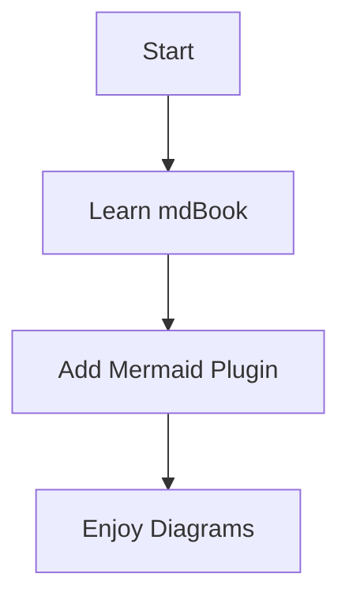

### ✅ How to Enable Mermaid in `mdBook`

#### 1. 📦 **Install `mdbook-mermaid`**

If you have Rust installed, run:

```bash
cargo install mdbook-mermaid
```

> Make sure `~/.cargo/bin` is in your `PATH`.

---

#### 2. ⚙️ **Edit `book.toml`**

Add this to your `book.toml` to register the plugin:

```toml
[book]
title = "Your Book Title"

[preprocessor.mermaid]
```

This tells `mdBook` to use the `mdbook-mermaid` preprocessor during build.

---

#### 3. 📝 **Use Mermaid in Markdown**

You can now use Mermaid diagrams like this:

<pre>

</pre>

---

#### 4. 🛠️ **Build the Book**

Use:

```bash
mdbook build
```

And open the result in your browser (usually in `book/index.html`).

---

### 📌 Notes

* Make sure you're not using a very old version of `mdBook` (<0.4).
* If Mermaid doesn’t render, check for browser JS errors or version mismatches.

---

